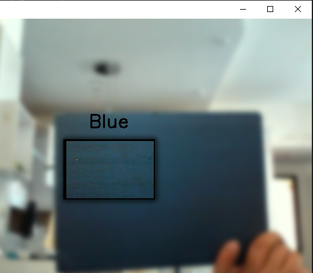
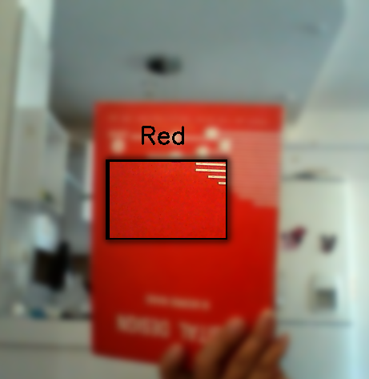
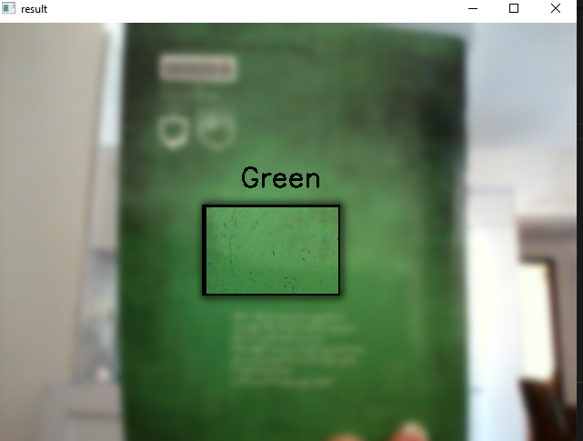
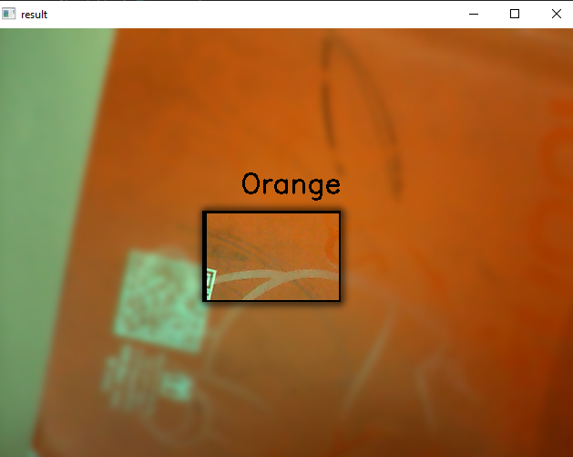
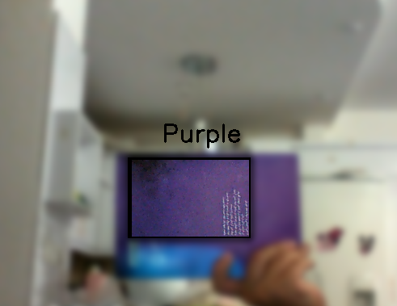
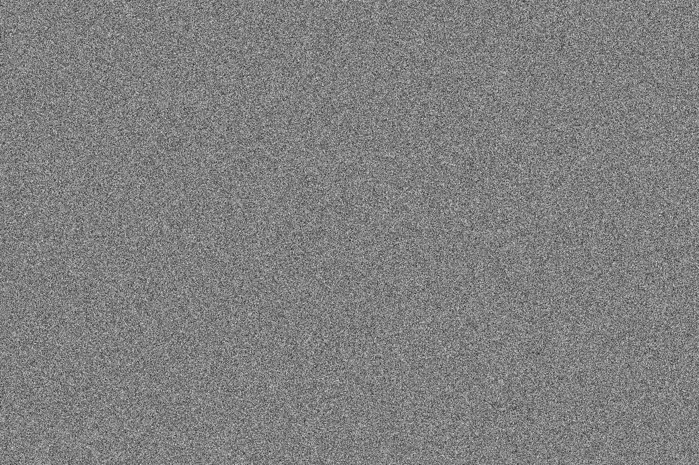
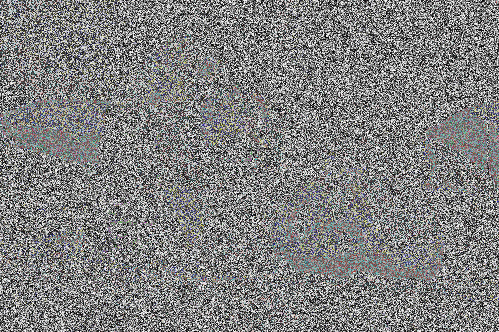
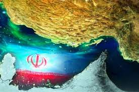

# Image Processing


simple projects using opencv with python.


## python

This project is written in Python version 3.10.8

I have used the [opencv](https://pypi.org/project/opencv-python/) and [Numpy](https://numpy.org/) 


### **How to install**
---

Run following commands:
 ```
pip install -r requierments.txt
 ```
### **My Projects**
 ---

**First**   :   **Color detection**


### **How to Run**
excecute this command in terminal:
 ```
 Color_detection\main.py
  ```
   


---

### **result**


---











---
**Second**   :   **Encryption and Decryption an image**


### **How to Run**
excecute this command in terminal:
 ```
 En_Dn_image\main.py
  ```
### **input**   

### **Secret key**
---


### **Encrypted image**
---


---

### **Decrypted image**
---


---


**Theard**   :   **Transparent**


### **How to Run**
excecute this command in terminal:
 ```
 Transparent\main.py
  ```
### **input**


### **result**
   

---

**Forth**   :   **Write farsi text on image**


### **How to Run**
excecute this command in terminal:
 ```
 Write_Farsi_text\main.py
  ```
### **input**   

### **result**
   

---

